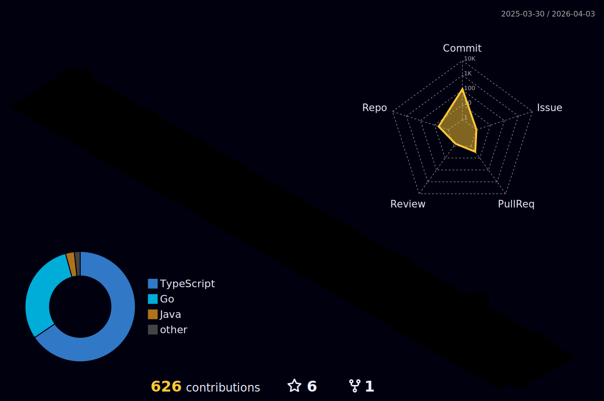

|  |
|:---:|

 
Engenheiro de Software com 4+ anos de experiência profissional, formado em <strong>Análise e Desenvolvimento de Sistemas (Ensino Superior)</strong> e <strong>Desenvolvimento Web (Especialização Técnica)</strong>. Atuando principalmente em backend e arquitetura de aplicações, com foco em APIs, microserviços, performance e escalabilidade. <a href="mailto:jalvess021@gmail.com" title="Gmail">EMAIL</a> | 
  <a href="https://linkedin.com/in/jalvess021" title="LinkedIn">LINKEDIN</a>

<ul> 
  <li> Backend: Go (Golang), PHP (Laravel), Node.js </li>
  <li> Frontend: TypeScript </li>
  <li> Arquitetura: Microsserviços, DDD, Arquitetura Hexagonal, Mensageria (Kafka, RabbitMQ) </li>
  <li> Infra & DevOps: Docker, CI/CD, Terraform, Cloud (AWS, DigitalOcean), Linux </li>
  <li> Dados: PostgreSQL, MySQL, MongoDB, Redis </li>
</ul>

|  |  | 
----------- | ----------- 
 

  

